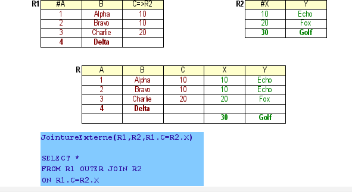
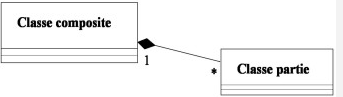

# NA17 - Fiche : CONCEPTION DE DONNEES RELATIONELLES

## L'héritage

**héritage :** transmission des propriété d'une classe à l'autre, permet de factoriser les classes. N'a pas de verbe associé à l'association, oralement on peut dire "est un"

**classe abstraite** classe non instanciable, n'a de sens que si une autre classe en hérite. Elle correspond à un groupe général de classes (*ex : mamifères*)

**héritage complet :** les classes filles n'ont aucunes caractéristiques qui leurs sont propres. Elles ont les même attributs

**héritage presque complet :** les classes filles ont le même nombre d'attributs et aucune autre association leur est lié. 

**héritage exclusif :** l'objet instancié appartiet à une seule des classes hérités.

**héritage non exclusif :** un objet peut appartenir aux 2 clases héritées. 

**héritage multiple :** une classe fille peut ériter de plusieurs de plusieurs classes mères 
ATTENTION : toujours justifier l'utilisation de l'héritage multiple

On peut transformer un héritage en associations : 1:1 --- 0:1 ou 1:1 --- 1:1

## Transformation de l'héritage en relationel

**Transformation de l'héritage**
- référence entre la classe mère et la classe fille
*Classe1(#a,b), Classe2(#a=>Classe1,c,d) avec c KEY, Classe3(#a=>Classe1,e,f) avec e KEY*
- héritage par les classes filles
*Classe2(#a,b,c,d) avec c KEY, Classe3(#a,b,e,f) avec e KEY*
- héritage par la classe mère
*Classe1(#a,b,c,d,e,f,t:{1,2,3}) avec c UNIQUE et e UNIQUE*

**Comment choisir le type de transformation de l'héritage**

Si _l'héritage est complet_ : transformation par la classe mère
- Si la classe mère est abstraite :
    Classe1(#a,b,t:{2,3})
- Si la classe mère n'est pas abstraite :
    Classe1(#a,b,t:{1,2,3}) 
Si _l'héritage est non compet, que la classe mère est abstraite_ et sans associations, héritage par les classes filles :
Classe2(#a,b,c,d) avec c KEY
Classe3(#a,b,e,f) avec e KEY

Si _l'héritage est non complet et que la classe mère est non abstraite_ et sans associations héritage par référence : 
Classe1(#a,b)
Classe2(#a,b,c,d) avec c KEY
Classe3(#a,b,e,f,fka=>Classe2) avec e KEY 

Si _l'héritage est presque complet_ on peut transformer par la classe mère :
Classe1(#a,b,c,d,e,f,t:{1,2,3})

**Cas problématiques**
- association sur la classe mère et héritage par les classes filles :
Classe2(#a,b,c,d) avec c KEY
Classe3(#a,b,e,f) avec e KEY
Classe4(#g,h,fka=>Classe2, fkb=>Classe3)
Contrainte : fka OR fkb
- héritage non complet par la classe mère (association M:N ou 1:N sur une classe fille)
Classe1(#a,b,c,d,e,f,t:{1,2,3})
Classe4(#g,h,fka=>Classe1)
Contraintes : Classe4.fka ne référence que des enregistrements tels que Classe1.t=3

- héritage non complet par la classe mère (et association entre les classes filles)
Classe1(#a,b,c,d,e,f,fka=>Classe1,t:{1,2,3})
Contraintes : fka ne référence que des enregistrements tels que t=2 ; si fka alors t=3

ATTENTION : un héritage non exclusif ne doit jamais être traité par les classes filles. 

## Implémentation d'une base de donnée dans Postgres

=> voir fiche papier

## Algèbre relationelle

**Projection** Affiche seulement les attributs précisés
**Restriction** Selectionne seulement certains objets d'une table en fonction d'une condition
**Produit** : a chaque ligne de table 1, associe chacune des lignes de table2
**Jointure** : Joindre 2 tables sur une condition

**Jointure Naturelle :** les attributs de la table 1 et la table 2 ont le meme nom d'attributs donc pas besoin de les spécifier. La codition de jointure est implicite.

**Jointure Externe :** renvoie les tuples de la jointure 1 et 2 avec les attributs nulls si pas de correspondance

- gauche : tuples de la premiere relation et les tuples de la jointure
- droite : tuple de la seconde relation et les tuples de la jointure

Ces jointures servent à trouver des tuples qui ne sont pas référencés dans une autre table

**Union Externe** : permet de faire l'union de 2 relations n'ayant pas le schéma, les attributs non évalués sont mis à NULL

**Différence** : Table1 et Table 2 ont le meme schéma, la différence de Table1, Table2 renvoit les tuples de R1 non présents dans R2.

**Intersection** : renvoit les tuples appartenant à table1 et Table2.

**Union** : renvoit une table composée de tous les tuples de table1 et table2

**division** : Table1 et Table2 ont un attribut en commun, Table1 à un attribut de plus que Table2, Table3 donne les attributs de Table1 n'appartenant pas à Table2. La concaténation de table3 et Table2 donne Table1.

Elle permet de répondre à l question : "donnez tous les élèveq qui ont tous les prénoms ..."

Sont retourné les tubles ayant comme attributs toutes les valeurs de table2.

**Notation :**
R = Union (R1, R2)
R = Différence (R1, R2)
R = Intersection (R1, R2)
R = Projection (R1, A1, A2, ...)
R = Restriction (R1, condition)
R = Produit (R1, R2)
R = Jointure (R1, R2, condition)
R = JointureNaturelle (R1, R2)
R = JointureExterne (R1, R2, condition)
R = JointureGauche (R1, R2, condition)
R = JointureDroite (R1, R2, condition)
R = Division (R1, R2)

## Interrogation base de données
**SELECT (liste d'attributs (t1.attribut1 AS a1, ...)) FROM (liste de table (table1 t1, table2 t2, ...)) WHERE (condition)**

**Expression de la condition**
P=C - 
P<>C - 
P<C - 
P>C - 
P>=C - 
P<=C - 
P BETWEEN C1 AND C2 - 
P IN (C1, C2 ...) - 
P LIKE 'chaîne' ( la chaîne est décrite avec % (0 ou plusieurs caractères quelconques) et _ (1 et 1 seul caractère)) - 
P IS NULL

**SELECT DISTINCT** permet d'éliminer les doublons dans la table renvoyée

**ORDER BY attribut1, attribut2** les tuples sont triées selon le premier attribut puis par le second attribut en cas de doublons. Par défaut les tris sont par ordre croissant si on veut par ordre decroissont on précise DESC à la fin de l'attribut concerné par le trie décroissant.

**Projection de constante** SELECTE constante ('1') AS nom (num)

/* Commentaires */
-- Commentaires

**Restriction** SELECT * FROM R1 WHERE condition
**Projection** SELECT A1, A2 FROM R1
**Produit** SELECT * FROM R1, R2
**Jointure** SELECT * FROM R1 INNER JOIN R2 ON R1.C=R2.X // SELECT * R1, R2, Ri WHERE condition
**Autojointure** SELECT E1.nom FROM employé E1, employé E2 WHERE E1.nom=E2.nom
**Jointure naturelle** SELECT * FROM R1, R2 WHERE R2.NUM = R1.NUM
**Union** SELECT * FROM R1 UNION SELECT * FROM R2
**Intersection**  SELECT * FROM R1 INTERSECT SELECT * FROM R2
**Différence** SELECT * FROM R1 EXCEPT SELECT * FROM R2

## Modélisation avancée des assocaitions en UML relationel

**Composition** Le cycle de vie des 2 classes sont liées si la classe composite disparait la classe partie disaprait aussi.

Du coté de la classe partie la cardinalité peut être 0..1, 1, * ou 1...*
Est composé de clé(s) locale(s)
En modèle logique elle se traduit comme une association 1 : N

**Agréagation** Peut aussi être notée par une association n:n

**Associaiton reflexive** Une classe qui s'associé à elle même, si une instance ne peut pas s'associer à elle même ajouter pk <> fk et en SQL on traduira par CHECK pk != fk

**Passage des association en modèle logique**
*association 1:1* 
- on la traite comme une association 1:N et on ajoute la contrainte UNIQUE sur la clé étrangère (associaiton 0..1 : 1..1, associaiton 0..1 : 0...1)
- on les fusionne en une seule classe avec la clé de l'association 2 en tant que UNIQUE ou KEY (association 1..1 : 1...1)

ATTENTION : cela doit avoir du sens selon le contexte !

## Modélisation conceptuelle de données avancées avec diagramme de classe UML

